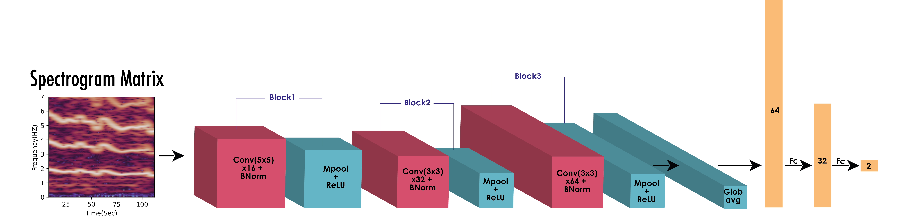
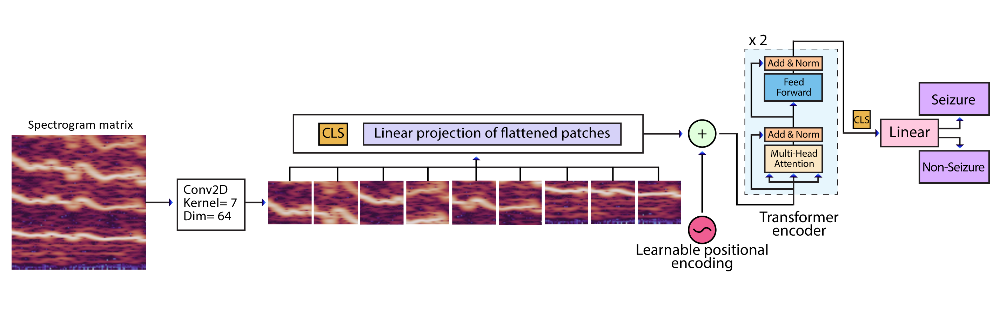

# Seizure Spectrogram Classification with CNN and CNN-ViT

This repository contains the code used in my published project on seizure detection from spectrogram images. It includes two experimental pipelines:
While designed for ECG data, the models are **fully adaptable for other image classification tasks**, making them reusable beyond this project.

- a custom convolutional neural network (CNN)
- a hybrid CNN-Vision Transformer (CNN-ViT) model

The project was trained and evaluated on private clinical data that cannot be shared because of data privacy restrictions. For that reason, the repository contains the full training and evaluation code, configuration files, and experiment structure, but not the raw dataset or trained weights. All results and detailed information are available in my paper "Investigating the Applicability of ECG Signals for Neonatal Seizure Detection Using ECG Spectrograms and CNN-ViT" 
which was presented at the Biosignals conference, 2026. 
>Available at: https://www.scitepress.org/Papers/2026/143263/143263.pdf

## What This Project Does

The goal is to classify spectrogram images into seizure and non-seizure classes using supervised deep learning. Both model variants follow the same experimental protocol:

- patient-level 5-fold cross-validation
- train/validation splitting from the training fold only
- class-weighted loss to address imbalance
- learning-rate scheduling with warmup and cosine annealing
- per-fold test evaluation with accuracy, AUC, F1 score, MCC, confusion matrix, and ROC curve output
- MLOps habits such as configuration-driven experiments, reproducible seeding, patient-level splitting to avoid leakage, Weights & Biases tracking, saved model artifacts, structured result outputs, and hardware-aware training with GPU/CPU fallback were used

## Repository Structure

The repository is split into two model families:

- `CNN/` - custom convolutional baseline
- `CNNViT/` - hybrid convolutional + vision transformer architecture

Each folder contains:

- `main.py` - end-to-end experiment entry point
- `dataset_builder.py` - dataset loading and dataloader construction
- `model.py` - model definition and weight initialization
- `train.py` - training loop, validation loop, and metric logging
- `test.py` - held-out test evaluation and result export
- `utils.py` - parameter handling, model saving, and device utilities
- `parameters/` - JSON hyperparameter configuration

## Data Format

The code expects preprocessed spectrogram tensors stored as `.pt` files, organised in two top-level folders:

- `ANSeR1/`
- `ANSeR2/`

Each `.pt` file should contain at least:

- `spectrogram` - the input tensor
- `seizure` - the binary label

The loader reads all files from both folders, concatenates them into a single dataset, and groups samples by patient ID to avoid leakage across cross-validation folds.


## Method Summary

### CNN

The CNN baseline uses stacked convolution, batch normalization, ReLU, max pooling, adaptive average pooling, and a small fully connected classifier head.

### CNN-ViT

The CNN-ViT model converts each spectrogram into patch embeddings, prepends a learnable `[CLS]` token, adds learnable positional embeddings, and processes the sequence with transformer encoder blocks before classification.


## How to Run
Install the dependencies from the included `requirements.txt`.
Update the command-line arguments in `main.py` or pass them directly when running the script:

```bash
python CNN/main.py --data_dir "<path-to-spectrogram-root>"
python CNNViT/main.py --data_dir "<path-to-spectrogram-root>"
```

The data root should contain the `ANSeR1` and `ANSeR2` folders expected by the loader.

Each run creates a dated results directory containing:

- `model_parameters.pth` and `bestmodel_parameters.pth`
- `mymodel.pth` and `bestmodel.pth`
- `results.csv`
- `model_pred.csv`
- `AUC.png`


